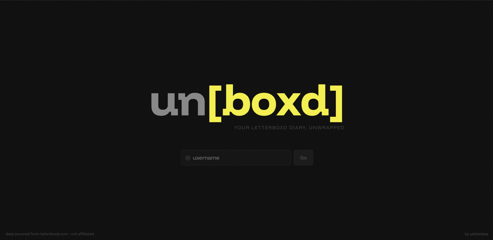
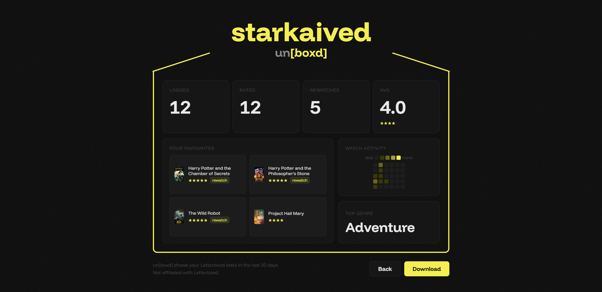

# unboxd

**your Letterboxd diary, unwrapped.**

unboxd gives you a beautiful visual summary of your Letterboxd activity — top films, watch streaks, genres, ratings, and more — all from your public diary.

> 

---

## features

- **30-day stats** — logged films, rated count, rewatches, and average star rating
- **four favourites** — your top-rated films from the past 30 days with posters
- **watch heatmap** — a 30-day calendar showing your activity intensity
- **top genre** — automatically calculated from your recent watches
- **one-click download** — screenshot your stats and share them

> 

---

## how it works

unboxd reads your public Letterboxd RSS feed — no login or API key required. Just enter your username and it parses your diary to build the dashboard.

---

## stack

- [Next.js](https://nextjs.org/) — React framework
- [Tailwind CSS](https://tailwindcss.com/) — styling
- [Cheerio](https://cheerio.js.org/) — RSS/HTML parsing
- [html2canvas](https://html2canvas.hertzen.com/) — screenshot export

---

## running locally

```bash
npm install
npm run dev